# 🏢 Analiza danych HR — IBM HR Analytics Employee Attrition

**📚 Przedmiot:** Podstawy Analizy Danych, 2025/2026  
**👨‍🏫 Prowadzący:** dr inż. Karol Flisikowski, prof. PG

## 📌 Opis projektu

Eksploracyjna analiza danych (EDA) zbioru IBM HR Analytics dotyczącego rotacji pracowników (*attrition*). Celem projektu jest identyfikacja czynników wpływających na odejście pracowników z firmy oraz przygotowanie danych do przyszłego modelowania klasyfikacyjnego.

### 📋 Treść zadania (wg prowadzącego)

Analityka HR pomaga w interpretacji danych organizacyjnych. Znajduje trendy związane z ludźmi i pozwala działowi HR podjąć odpowiednie kroki, aby organizacja działała sprawnie i przynosiła zyski. *Attrition* w korporacji jest jednym ze złożonych wyzwań, z którymi muszą sobie radzić menedżerowie i pracownicy HR.

Modele uczenia maszynowego można wdrożyć w celu przewidywania potencjalnych przypadków odejść, pomagając odpowiedniemu personelowi HR podjąć niezbędne kroki w celu zatrzymania pracownika.

**✅ Wymagane zadania:**

🧹 *Czyszczenie danych:* usunięcie zbędnych kolumn, zmiana nazw kolumn, usuwanie duplikatów, czyszczenie poszczególnych kolumn, usuwanie wartości NaN, obsługa wartości brakujących i odstających, dodatkowe transformacje.

📊 *Wizualizacja danych:* mapa korelacji dla zmiennych numerycznych, nadgodziny, stan cywilny, rola zawodowa, płeć, dziedzina wykształcenia, dział, podróż służbowa, związek między nadgodzinami a wiekiem, łączna liczba lat pracy, poziom wykształcenia, liczba przepracowanych firm, odległość od domu.

## 🗃️ Dataset

**📄 Plik:** `HR.csv`  
**📏 Rozmiar:** 1470 wierszy × 35 kolumn  
**🔗 Źródło:** IBM HR Analytics (via [kflisikowski/analiza_danych_projekt_zespolowy](https://github.com/kflisikowski/analiza_danych_projekt_zespolowy))

### Opis

Analityka HR pomaga w interpretacji danych organizacyjnych — znajduje trendy związane z ludźmi i pozwala działowi HR podjąć odpowiednie kroki, aby organizacja działała sprawnie i przynosiła zyski. Rotacja pracowników (*attrition*) jest jednym ze złożonych wyzwań, z którymi muszą sobie radzić menedżerowie i pracownicy HR.

Modele uczenia maszynowego można wdrożyć w celu przewidywania potencjalnych przypadków odejść, pomagając działowi HR podjąć niezbędne kroki w celu zatrzymania pracownika.

**🎯 Zmienna docelowa:** `Attrition` — czy pracownik odszedł z firmy (Yes/No)

### ⚠️ Braki danych (celowe, do obsługi w projekcie)

| Kolumna | Braki | % |
|---|---|---|
| `Age` | 100 | 6.8% |
| `Attrition` | 150 | 10.2% |
| `MonthlyIncome` | 150 | 10.2% |

**🗑️ Kolumny stałe (do usunięcia):** `EmployeeCount`, `StandardHours`, `Over18`, `EmployeeNumber`

### 🔍 Zakres analizy

**🧹 Czyszczenie danych:**
- Usunięcie zbędnych kolumn
- Usuwanie duplikatów
- Czyszczenie poszczególnych kolumn
- Usuwanie wartości NaN
- Obsługa wartości brakujących i odstających

**📊 Wizualizacje:**
- Mapa korelacji dla wszystkich zmiennych numerycznych
- Nadgodziny
- Stan cywilny
- Rola zawodowa
- Płeć
- Dziedzina wykształcenia
- Dział
- Podróż służbowa
- Związek między nadgodzinami a wiekiem
- Łączna liczba lat pracy
- Poziom wykształcenia
- Liczba przepracowanych firm
- Odległość od domu

## 👤 Autor

**Vitaliy Arkhanhelski**

Projekt zrealizowany samodzielnie — obejmuje wszystkie 4 etapy pipeline'u analizy danych.

---

### 🧹 Etap 1 — Czyszczenie danych [`src/preprocessing.py`]

**Dlaczego ten etap?** Surowy dataset HR.csv zawiera celowo wprowadzone braki (`Age`, `Attrition`, `MonthlyIncome`) oraz kolumny bezużyteczne dla analizy. Bez czyszczenia dalsze etapy dałyby błędne wyniki — każda analiza statystyczna i wizualizacja zależy od jakości danych wejściowych.

**Eksploracja (`dataset_analysis`):**
- Wizualizacje wzorców braków: matrix, heatmapa, dendrogram (`missingno`)
- Statystyki opisowe datasetu (`skimpy`)
- Analiza mechanizmu braków: testy Mann-Whitney U i Chi-kwadrat → **MCAR**

| Macierz braków | Heatmapa braków | Dendrogram |
|---|---|---|
| 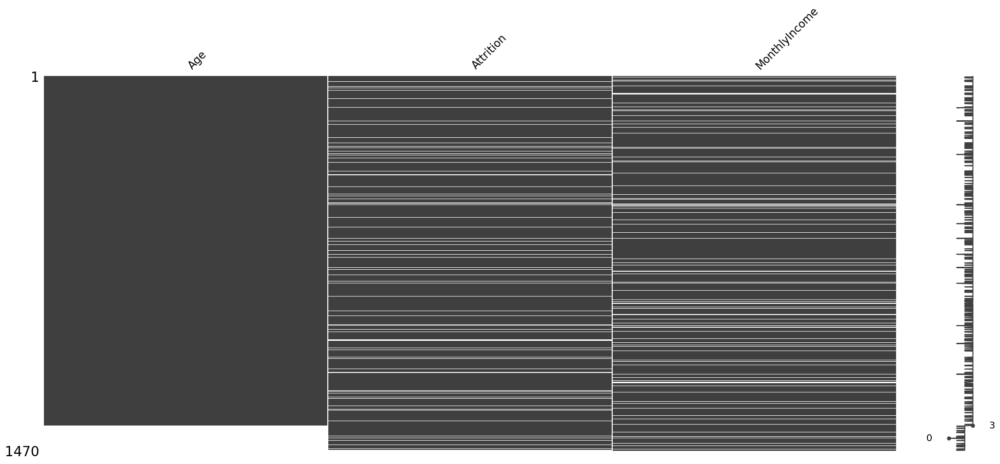 | 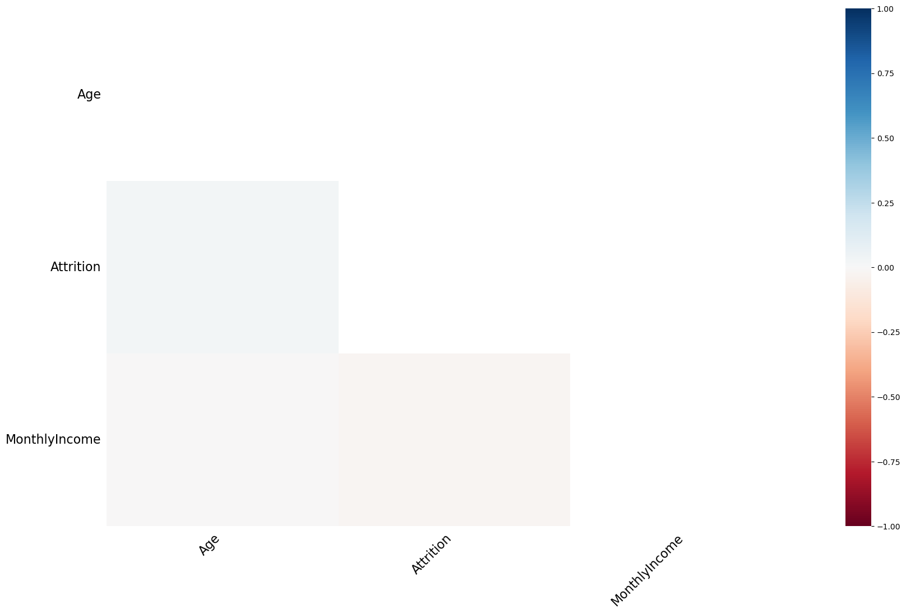 | 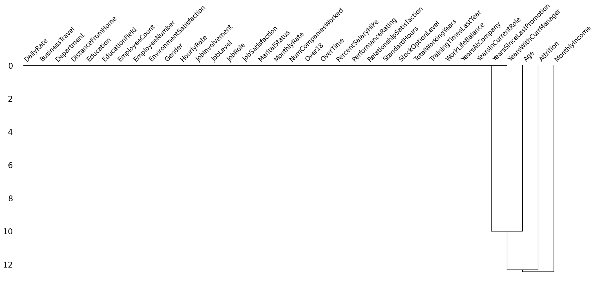 |

**Czyszczenie (`clean_data`):**
- Usunięcie duplikatów
- Usunięcie kolumn stałych: `EmployeeCount`, `StandardHours`, `Over18`, `EmployeeNumber`
- Imputacja `Age` — **KNN Imputer** (K=6, wybór metodą łokcia MSE)
- Imputacja `MonthlyIncome` — **KNN Imputer** (K=4, wybór metodą łokcia MSE)
- `Attrition` — **nie imputować** (zmienna docelowa)
- Wykrycie wartości odstających metodą IQR — tabela + boxploty top 6 kolumn ciągłych
- Zapis oczyszczonego datasetu → [`HR_clean.csv`](data/HR_clean.csv)

**Wybór cech do KNN — korelacje i Mutual Information:**

| Age | MonthlyIncome |
|---|---|
| 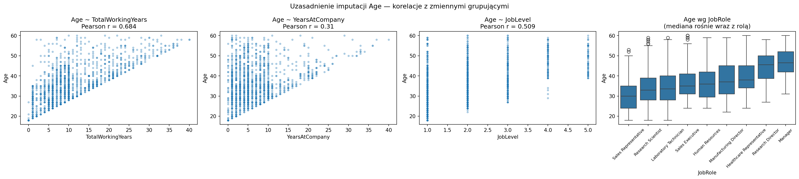 | 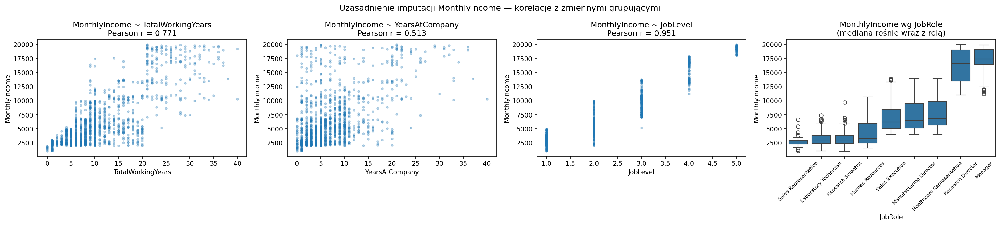 |
| 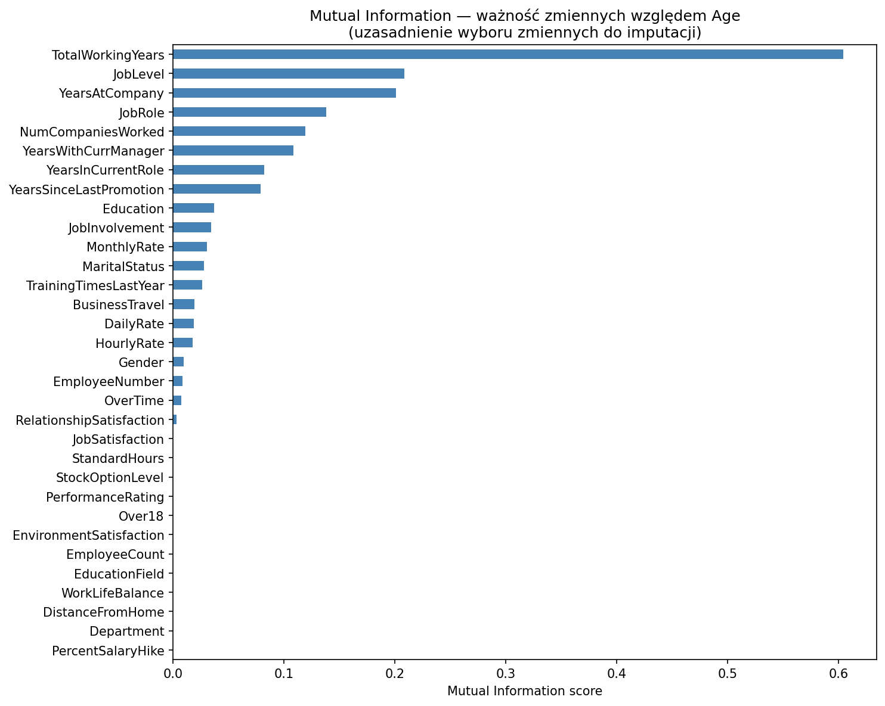 | 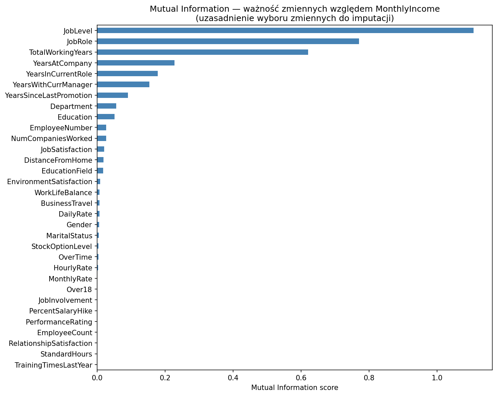 |

**Wybór K metodą łokcia (MSE):**

| Age (K=6) | MonthlyIncome (K=4) |
|---|---|
| 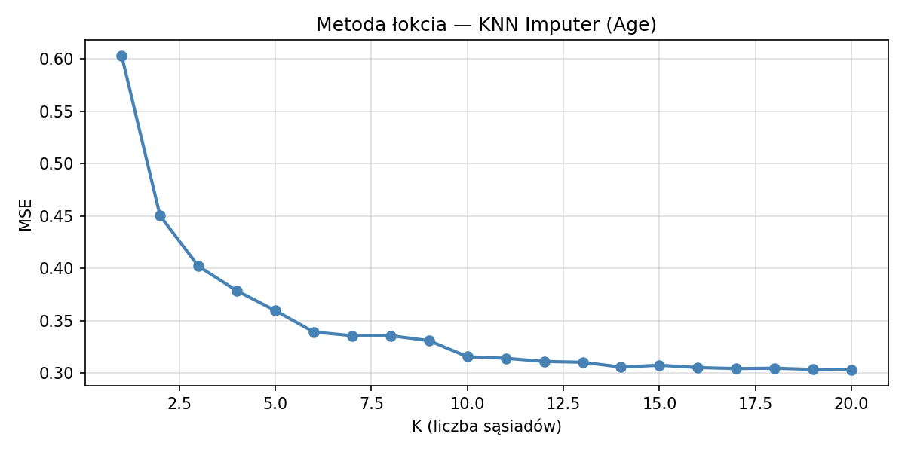 | 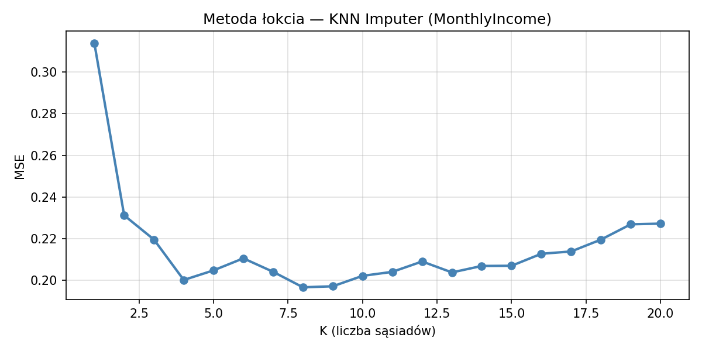 |

**Analiza wartości odstających (IQR):**

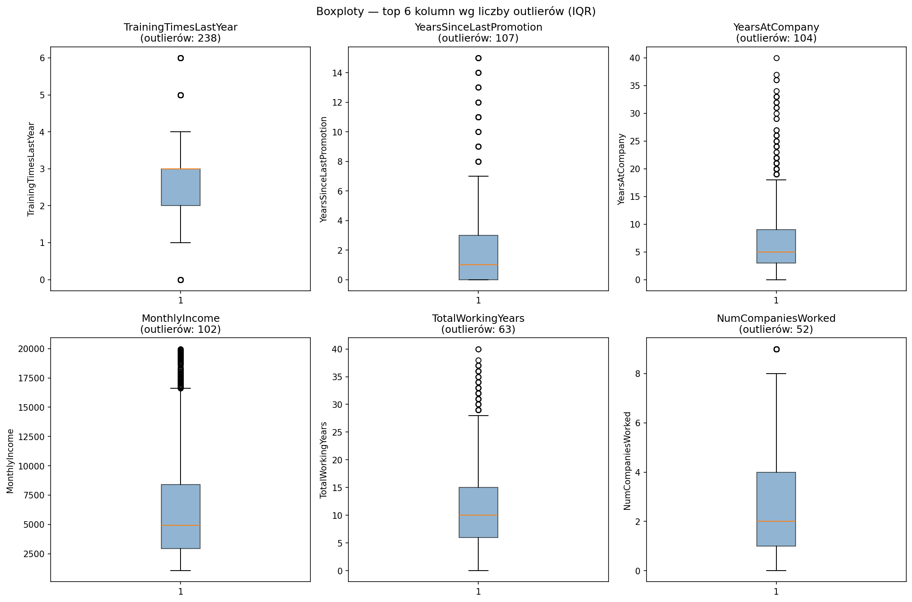

**Artefakty w `data/stage1_preprocessing/`:**
- `age_imputed_rows.csv` — 100 wierszy z wartościami wstawionymi przez KNN
- `monthlyincome_imputed_rows.csv` — 150 wierszy z wartościami wstawionymi przez KNN
- `age_imputation_stats.csv` — mean/std/median przed i po imputacji
- `monthlyincome_imputation_stats.csv` — mean/std/median przed i po imputacji
- `outliers_summary.csv` — tabela IQR dla wszystkich kolumn numerycznych

📥 **Wejście:** surowy `df` z `data_loader.load_data()`  
📤 **Wyjście:** oczyszczony `DataFrame` przekazywany dalej

---

### 📈 Etap 2 — Analiza opisowa i wnioskowanie statystyczne [`src/stage2_descriptive/descriptive_analysis.py`]

**Dlaczego ten etap?** Po oczyszczeniu danych należy zrozumieć ich rozkłady i sprawdzić, które zmienne statystycznie różnią się między pracownikami, którzy odeszli, a tymi, którzy pozostali. Testy statystyczne dają obiektywne podstawy do wyboru zmiennych do modelu.

**Zadania:**
- Analiza zmiennej docelowej `Attrition` — rozkład klas: **Yes=214 (16.2%), No=1106 (83.8%)**
- Statystyki opisowe zmiennych numerycznych: mean, median, std, skewness, kurtosis, CV
- Histogramy i violin ploty z podziałem na `Attrition = Yes / No`
  - Kolumny wybrane automatycznie wg testu Manna-Whitneya (p < 0.05) — bez hardcodu
- Testy statystyczne (tylko wiersze z wypełnionym Attrition — 1320/1470):
  - zmienne numeryczne vs `Attrition` → **test Manna-Whitneya** (nieparametryczny)
  - zmienne kategoryczne vs `Attrition` → **test Chi-kwadrat**
- Ranking istotności — **21/30 zmiennych istotnych** (p < 0.05)
- Najsilniejszy związek: `OverTime`, `MonthlyIncome`, `JobRole`, `MaritalStatus`, `Age`
- Brak związku: `HourlyRate`, `MonthlyRate`, `PerformanceRating`, `Gender`

| Rozkład Attrition | Ranking istotności zmiennych |
|---|---|
| 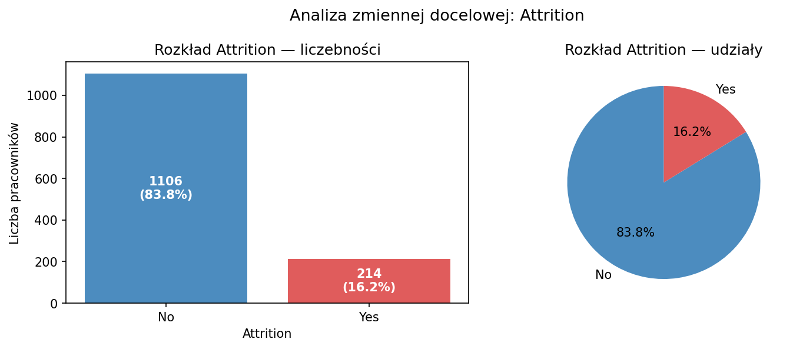 | 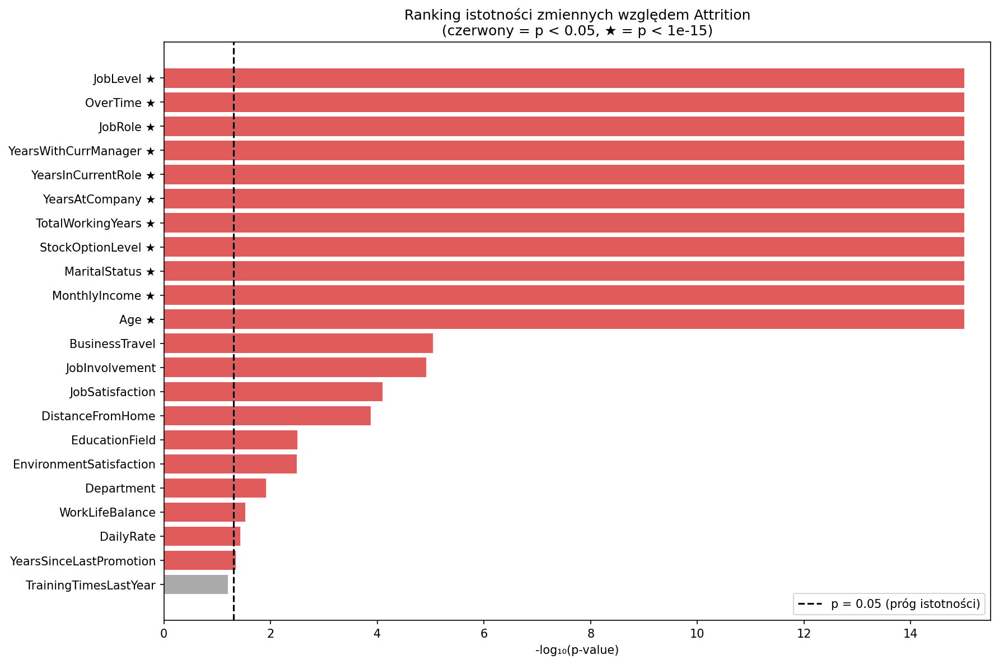 |

**Histogramy — top 15 zmiennych numerycznych (p < 0.05) wg Attrition:**

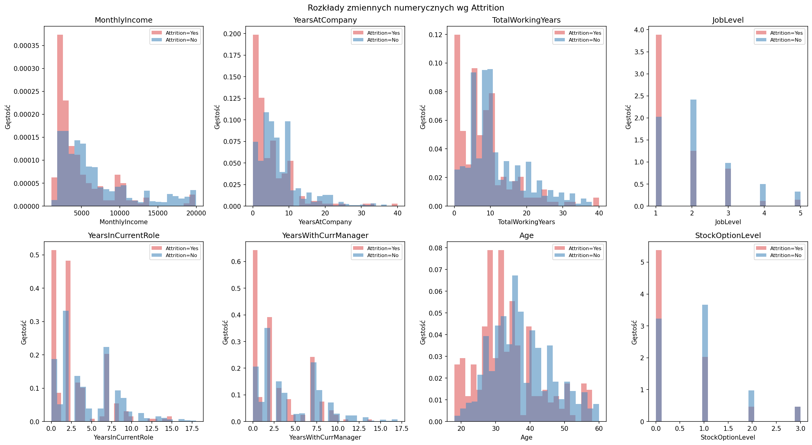

**Violin ploty — rozkład i mediany wg Attrition:**

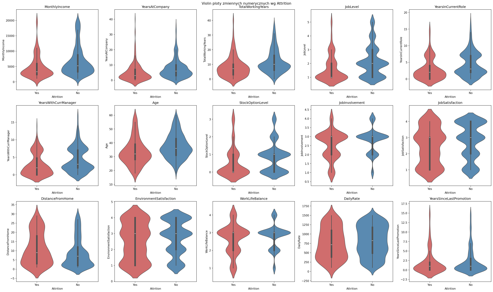

**Artefakty w `data/stage2_descriptive/`:**
- `descriptive_stats.csv` — statystyki opisowe wszystkich zmiennych numerycznych (mean, std, skewness, kurtosis, CV)
- `statistical_tests.csv` — p-value dla każdej zmiennej vs Attrition (Mann-Whitney U + Chi-kwadrat)

📥 **Wejście:** [`HR_clean.csv`](data/HR_clean.csv) / oczyszczony `df`  
📤 **Wyjście:** wykresy + podsumowanie wyników testów

---

### 🔗 Etap 3 — Analiza korelacji i wizualizacje [`src/stage3_correlation/correlation_analysis.py`]

**Dlaczego ten etap?** Sama statystyka opisowa nie pokazuje wzajemnych zależności między zmiennymi. Wizualizacje korelacji i wykresy wg grup biznesowych (dział, rola, nadgodziny) pozwalają odkryć, jakie profile pracowników są najbardziej narażone na odejście.

**Zadania:**
- Macierz korelacji Spearmana dla zmiennych numerycznych — heatmapa
- Top 10 zmiennych najbardziej skorelowanych z `Attrition` → `top_correlations.csv`
- Cramer's V — macierz asocjacji zmiennych kategorycznych (tylko `object` kolumny)
- Attrition rate wg top 6 grup kategorycznych (wybór data-driven wg Cramer's V): `JobRole`, `OverTime`, `MaritalStatus`, `BusinessTravel`, `EducationField`, `Department`
- Parallel Coordinates — znormalizowane profile pracowników odchodzących vs pozostających (top 6 zmiennych wg Spearmana)

**Macierz korelacji Spearmana:**

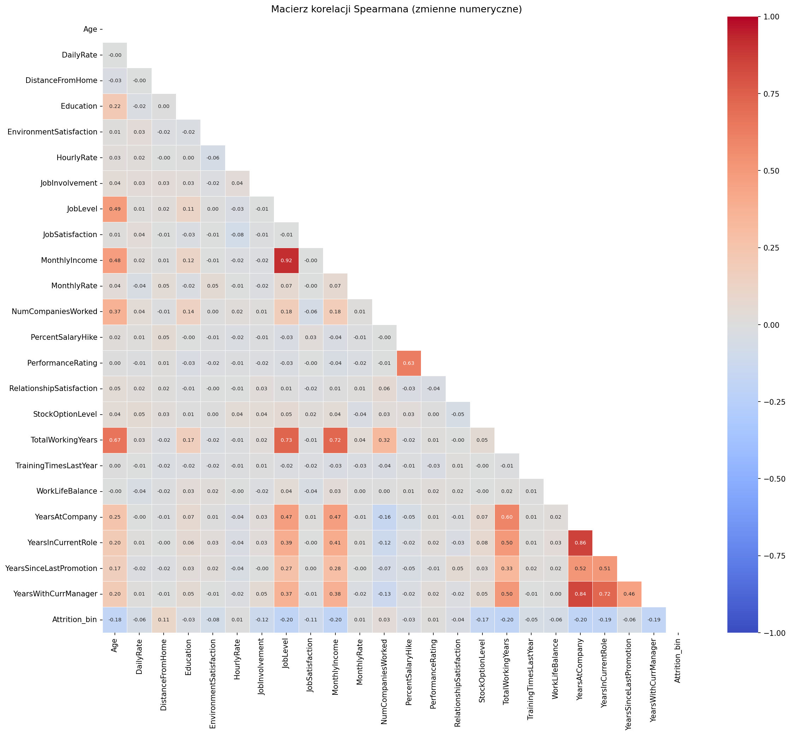

**Cramer's V — siła związku między zmiennymi kategorycznymi:**

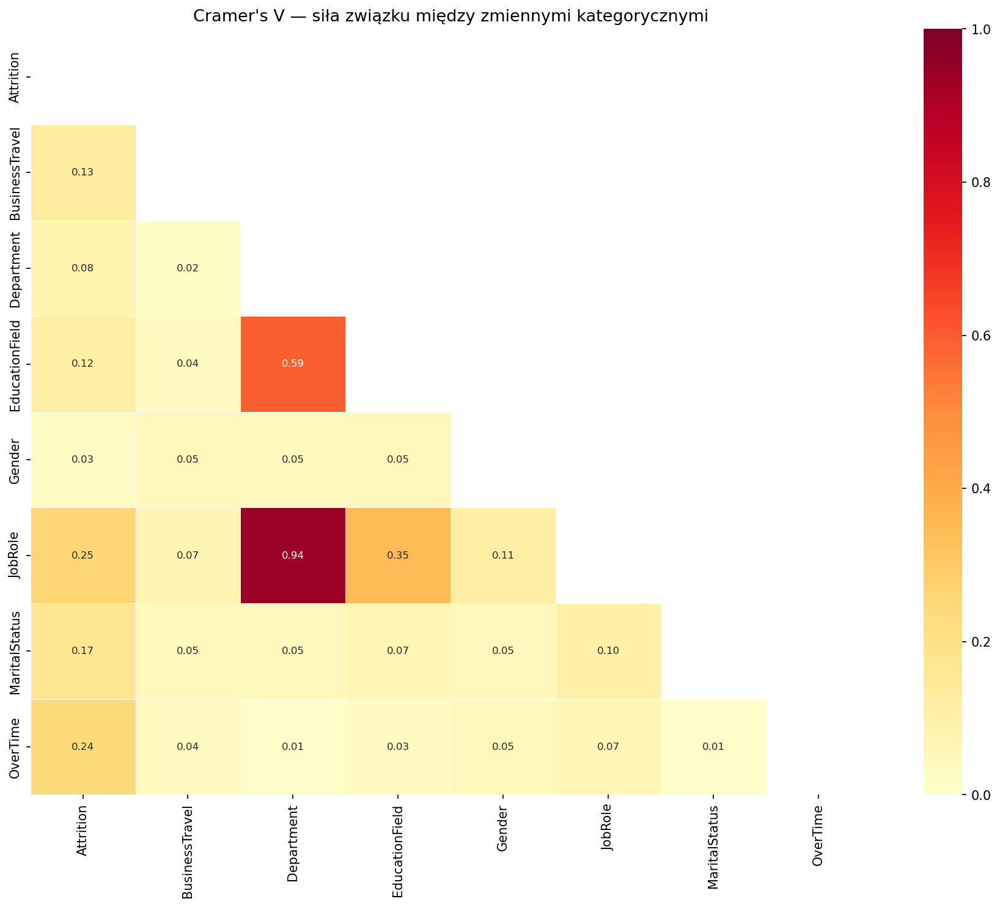

**Attrition rate wg grup (top 6 wg Cramer's V z Attrition):**

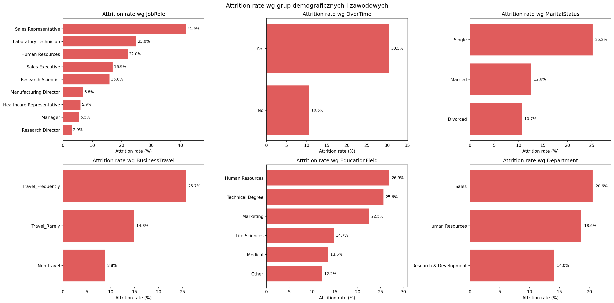

**Parallel Coordinates — profile pracowników:**

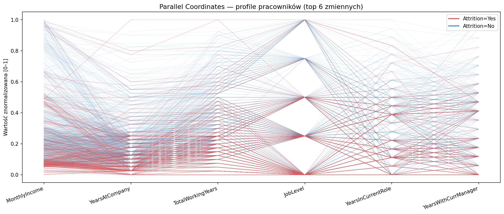

**Artefakty w `data/stage3_correlation/`:**
- `top_correlations.csv` — top 10 zmiennych numerycznych najsilniej skorelowanych z Attrition (Spearman)

📥 **Wejście:** [`HR_clean.csv`](data/HR_clean.csv) / oczyszczony `df`  
📤 **Wyjście:** wykresy PNG + CSV z top korelacjami

---

### 📐 Etap 4 — ANOVA i ANCOVA [`src/stage4_anova/anova_analysis.py`]

**Dlaczego ten etap?** Korelacje pokazują związek między zmiennymi, ale nie mówią czy różnice między grupami są statystycznie istotne po kontroli innych czynników. ANOVA testuje czy średnie różnią się między 3+ grupami, a ANCOVA sprawdza czy efekt grupowy pozostaje po uwzględnieniu covariatu (Age).

**Zadania:**
- **One-way ANOVA**: 16 par (4 numeryczne × 4 kategoryczne) — wyniki w `anova_results.csv`
- **ANCOVA**: kontrola covariatu `Age` dla 12 par — wyniki w `ancova_results.csv`
- Boxploty top 6 istotnych par (wg p-value)

**Zmienne:**
- Numeryczne (dependent): `MonthlyIncome`, `TotalWorkingYears`, `Age`, `JobLevel`
- Kategoryczne (grouping): `JobRole`, `Department`, `MaritalStatus`, `OverTime`
- Covariate: `Age`

**Boxploty istotnych różnic między grupami (top 6 par wg p-value):**

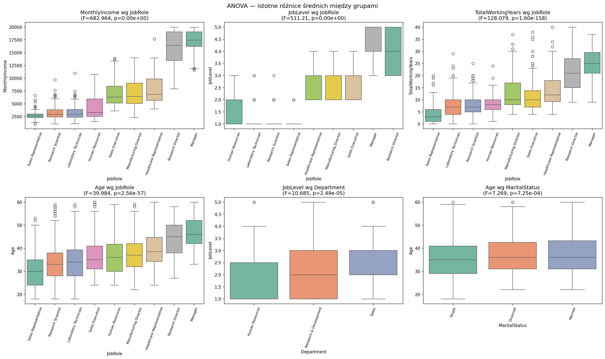

**Kluczowe wnioski z ANCOVA:**
- `JobRole` i `Department` → zachowują istotność po kontroli Age → efekt niezależny od wieku
- `MaritalStatus`, `OverTime` → tracą istotność po kontroli Age → różnice wynikały z różnic wiekowych

**Artefakty w `data/stage4_anova/`:**
- [`anova_results.csv`](data/stage4_anova/anova_results.csv) — F-statystyka i p-value dla 16 par (ANOVA)
- [`ancova_results.csv`](data/stage4_anova/ancova_results.csv) — p-value dla efektu kategorycznego i covariatu (ANCOVA)

📥 **Wejście:** [`HR_clean.csv`](data/HR_clean.csv) / oczyszczony `df`  
📤 **Wyjście:** CSV z wynikami + wykresy boxplot

---

### ⚙️ Etap 5 — Przygotowanie danych do modelowania [`src/stage5_preparation/data_preparation.py`]

**Dlaczego ten etap?** Modele uczenia maszynowego wymagają danych w formacie numerycznym i odpowiednio przeskalowanych. Ten etap zamyka cały pipeline EDA i produkuje gotowe datasety, które w przyszłości trafią bezpośrednio do treningu modelu klasyfikacyjnego.

**Zadania:**
- Encoding zmiennych kategorycznych:
  - Binary: `Attrition` (Yes=1/No=0), `Gender`, `OverTime`
  - Ordinal: `BusinessTravel` (Non-Travel=0, Travel_Rarely=1, Travel_Frequently=2)
  - One-Hot: `Department`, `EducationField`, `JobRole`, `MaritalStatus`
- Skalowanie 24 kolumn (ciągłe numeryczne + `BusinessTravel` ordinal; binarne 0/1 i one-hot 0/1 pozostają bez zmian):
  - Standaryzacja Z-score (`StandardScaler`) — mean=0, std=1
  - Normalizacja Min-Max (`MinMaxScaler`) — zakres [0, 1]
- Wizualizacja rozkładów przed i po skalowaniu (top 4 kolumny)
- Zapis finalnych datasetów (1320 wierszy × 48 kolumn)

**Wykres:**

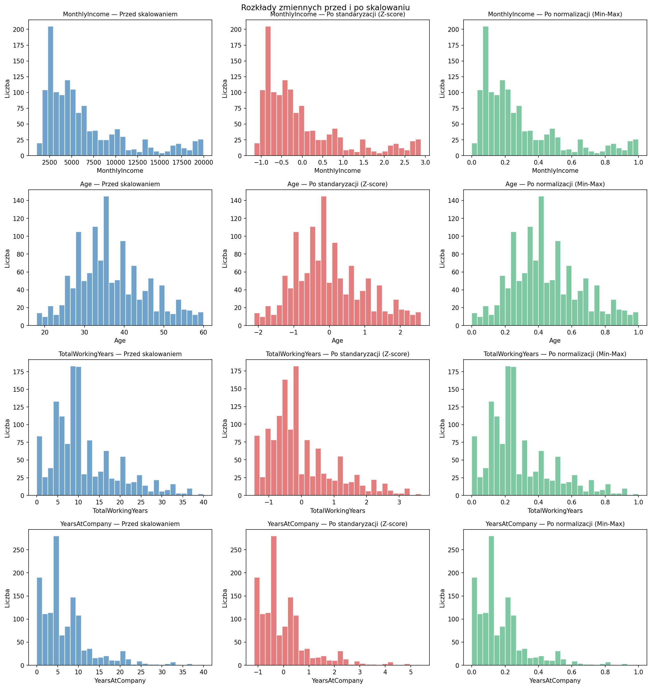

> Wykres potwierdza że kształt rozkładu nie zmienia się po skalowaniu — zmienia się tylko skala osi X. `MonthlyIncome` i `YearsAtCompany` mają widoczny ogon prawostronny (outliery), który StandardScaler zachowuje, a MinMaxScaler "ściska" ku lewej.

📥 **Wejście:** [`HR_clean.csv`](data/HR_clean.csv) / oczyszczony `df`  
📤 **Wyjście:** [`HR_model_standardized.csv`](data/HR_model_standardized.csv), [`HR_model_normalized.csv`](data/HR_model_normalized.csv)

**Pipeline EDA zakończony.** Oba pliki są gotowe do bezpośredniego użycia w trenowaniu modelu klasyfikacyjnego (np. Random Forest, regresja logistyczna, XGBoost).

## 🗂️ Pliki danych

| Plik | Wiersze | Kolumny | Do czego |
|---|---|---|---|
| [`HR.csv`](data/HR.csv) | 1470 | 35 | Surowy dataset — punkt wyjścia, nie modyfikowany |
| [`HR_clean.csv`](data/HR_clean.csv) | 1470 | 31 | Po czyszczeniu (Etap 1): usunięte stałe kolumny, imputacja Age i MonthlyIncome. Zawiera 150 wierszy z `Attrition=NaN` |
| [`HR_model_standardized.csv`](data/HR_model_standardized.csv) | 1320 | 48 | Gotowy do modelowania — encoding + standaryzacja Z-score (mean=0, std=1). Tylko wiersze ze znanym Attrition |
| [`HR_model_normalized.csv`](data/HR_model_normalized.csv) | 1320 | 48 | Gotowy do modelowania — encoding + normalizacja Min-Max ([0,1]). Tylko wiersze ze znanym Attrition |

> **Uwaga:** 150 wierszy z `Attrition=NaN` nie są stracone — istnieją w `HR_clean.csv` i można je zakodować/przeskalować w przyszłości, by użyć modelu do **predykcji** (nie trenowania).

---

## 📁 Struktura projektu

```
sad_eda_2026/
├── README.md
├── glossary.md                       # Słownik pojęć statystycznych
├── requirements.txt
├── assets/
│   └── banner.jpg
├── data/
│   ├── HR.csv                        # Surowy dataset
│   ├── HR_clean.csv                  # Generowany przez Etap 1 → data/HR_clean.csv
│   ├── HR_model_standardized.csv     # Generowany przez Etap 5
│   ├── HR_model_normalized.csv       # Generowany przez Etap 5
│   ├── stage1_preprocessing/         # Artefakty Etapu 1
│   │   ├── age_imputed_rows.csv
│   │   ├── age_imputation_stats.csv
│   │   ├── monthlyincome_imputed_rows.csv
│   │   ├── monthlyincome_imputation_stats.csv
│   │   └── outliers_summary.csv
│   ├── stage2_descriptive/           # Artefakty Etapu 2
│   │   ├── descriptive_stats.csv
│   │   └── statistical_tests.csv
│   ├── stage3_correlation/           # Artefakty Etapu 3
│   │   └── top_correlations.csv
│   ├── stage4_anova/                 # Artefakty Etapu 4
│   │   ├── anova_results.csv
│   │   └── ancova_results.csv
│   └── stage5_preparation/           # Artefakty Etapu 5 (pusty — dane w data/)
├── charts/
│   ├── msno/                         # Wykresy braków (missingno)
│   ├── age/                          # Analiza imputacji Age
│   ├── monthlyincome/                # Analiza imputacji MonthlyIncome
│   ├── knn/                          # Wykresy łokcia KNN
│   │   ├── age_knn_elbow.png
│   │   └── monthly_income_knn_elbow.png
│   ├── outliers_boxplots.png         # Boxploty top 6 kolumn z outlierami
│   ├── stage2_descriptive/           # Wykresy Etap 2
│   │   ├── attrition_distribution.png
│   │   ├── histograms_by_attrition.png
│   │   ├── violinplots_by_attrition.png
│   │   └── statistical_tests_ranking.png
│   ├── stage3_correlation/           # Wykresy Etap 3
│   │   ├── spearman_heatmap.png
│   │   ├── cramers_v_heatmap.png
│   │   ├── attrition_rate_by_groups.png
│   │   └── parallel_coordinates.png
│   ├── stage4_anova/                 # Wykresy Etap 4
│   │   └── anova_boxplots.png
│   └── stage5_preparation/           # Wykresy Etap 5
│       └── scaling_comparison.png
├── reports/
│   └── HR_profiling_report.html      # Automatyczny raport (ydata_profiling)
└── src/
    ├── settings.py                   # Ścieżki i konfiguracja projektu
    ├── main.py                       # Punkt wejścia — uruchamia cały pipeline
    ├── data_loader.py                # Wczytanie danych
    ├── report.py                     # Raport profilujący (ydata_profiling)
    ├── preprocessing.py              # Etap 1 — czyszczenie danych
    ├── plots.py                      # Etap 1 — wykresy EDA i imputacji
    ├── stage2_descriptive/           # Etap 2 — Osoba 2
    │   └── descriptive_analysis.py
    ├── stage3_correlation/           # Etap 3
    │   └── correlation_analysis.py
    ├── stage4_anova/                 # Etap 4
    │   └── anova_analysis.py
    └── stage5_preparation/           # Etap 5
        └── data_preparation.py
```

## 🔄 Pipeline

```
load_data()                           # wczytanie HR.csv
generate_report()                     # 📄 raport profilujący HTML
dataset_analysis()                    # 🔍 eksploracja: braki, testy MCAR/MAR
clean_data()                          # 🧹 Etap 1 [Vitaliy Arkhanhelski]
    ├── drop_duplicates()
    ├── drop_constant_cols()
    ├── impute_age()                  #    KNN K=6 + elbow chart
    ├── impute_monthly_income()       #    KNN K=4 + elbow chart
    ├── check_outliers()              #    IQR + boxploty
    └── save_clean_data()             # → HR_clean.csv
run() [descriptive]                   # 📈 Etap 2
run() [correlation]                   # 🔗 Etap 3
run() [anova]                         # 📐 Etap 4
run() [preparation]                   # ⚙️ Etap 5
```

## 🚀 Uruchomienie

```bash
pip install -r requirements.txt
python src/main.py
```

Raport profilujący zostanie zapisany w `reports/HR_profiling_report.html`.


## 📜 Licencja

CC BY-SA 4.0 — [Karol Flisikowski](https://github.com/kflisikowsky/analiza_danych_projekt_zespolowy)
